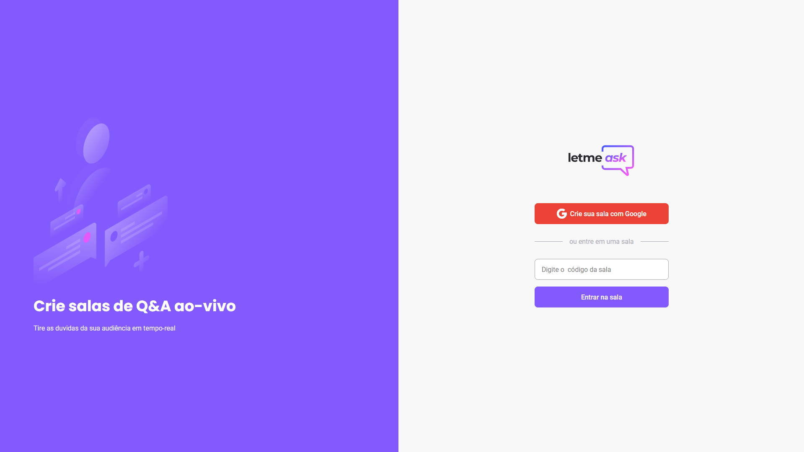
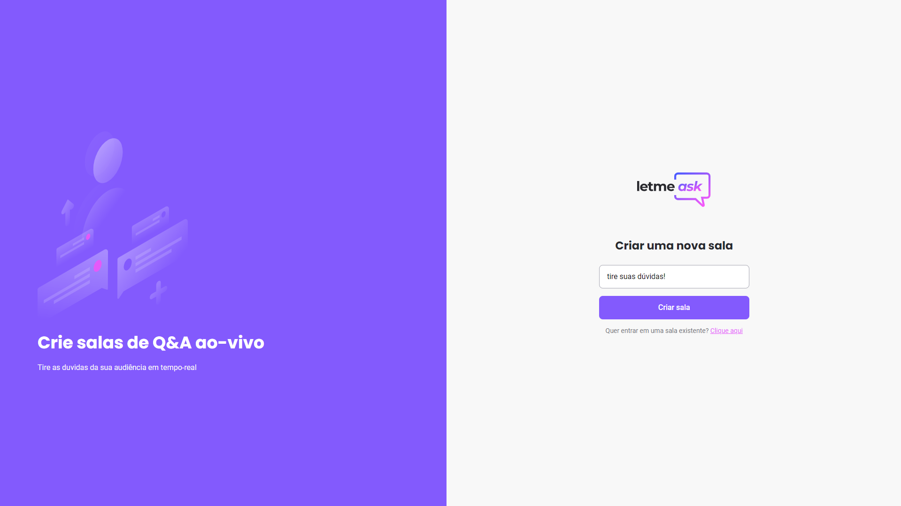
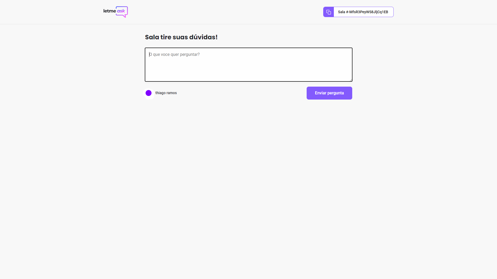

     

     

   

     

<h2>Projeto</h2>

Letmeask é um projeto criado para que pessoas possam criar salas de Q&A com o seu público, de uma forma facil, pratica e organizada.

   

     

<h2>Tecnologias</h2>
<ul>
   <li>React</li>
   <li>Firebase</li>
   <li>TypeScript</li>
</ul>
